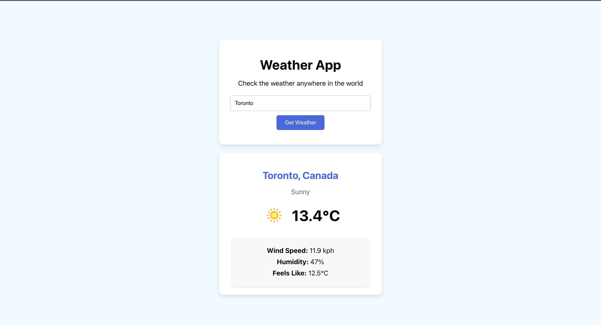

# Weather App

A weather application built with JavaScript and React that displays current weather conditions for any city worldwide.



## Features

- **Real-time Weather Data**: Displays current temperature, condition, humidity, wind speed, and "feels like" temperature
- **Location Search**: Search for any city worldwide
- **Autocomplete**: Suggestions appear as you type to help find locations quickly

## Run

In the project directory, you can run:

```
 npm start
```

Open [http://localhost:3000](http://localhost:3000) to view it in your browser.
